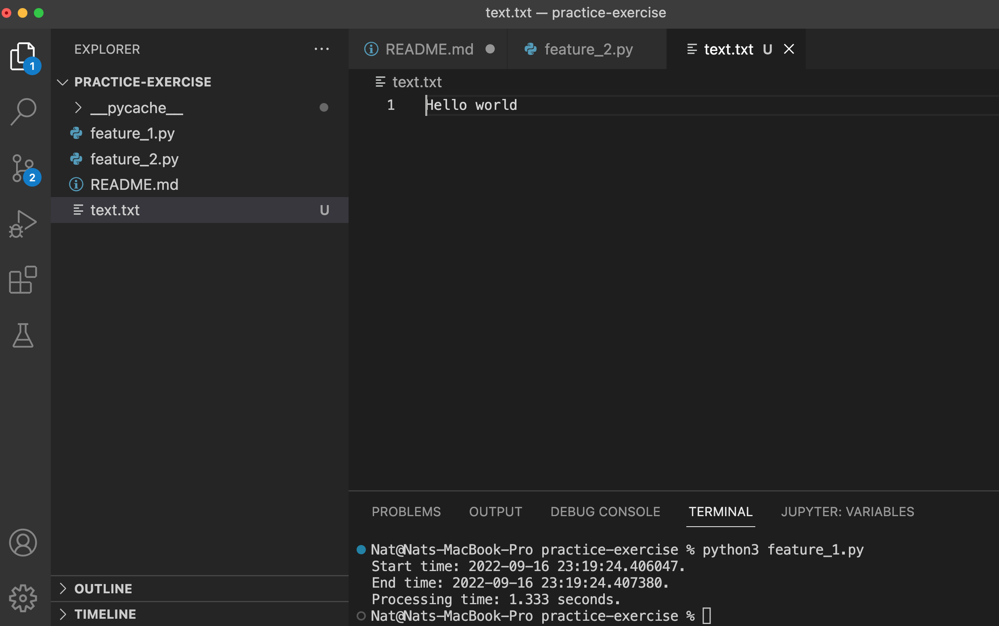

# Welcome to Practice Exercise

## Table of Contents
1. [Table of Contents](#table-of-contents)
2. [Pre-requisites](#pre-requisites)
    * [Python](#python)
3. [feature-1](#feature-1)
    * [What It Does](#what-it-does)
    * [How To Run](#how-to-run)
    * [Sample Output](#sample-output)
4. [feature-2](#feature-2)
    * [What It Does](#what-it-does-1)
    * [How To Run](#how-to-run-1)
    * [Sample Output](#sample-output-1)
5. [test](#test)
    * [What It Does](#what-it-does-2)
    * [How To Run](#how-to-run-2)
    * [Sample Output](#sample-output-2)

## Pre-requisites

### Python
Please have python3 installed and add it to your PATH variables.

Visit this page for instructions on how to install python3: [https://www.python.org/downloads/](https://www.python.org/downloads/)

## feature-1

### What It Does
feature-1 prints out the time at which the program starts running, the time at which the program finishes running, and the number of ms that passed.

### How To Run
Execute the following on the console

```bash
python3 feature_1.py
```

### Sample Output
```bash
% python3 feature_1.py
Start time: 2022-09-16 22:47:11.607163.
End time: 2022-09-16 22:47:11.609564.
Processing time: 2.401 seconds.
```

## feature-2

### What It Does
This feature creates a file named "text.txt" if it does not already exists in this directory, opens the file, and appends the sentence "Hello World" to the end of the file.

### How To Run
The main function of this feature will be executed within the main function of feature-1.

### Sample Output
A file called "text.txt" will be created, if not already there, and a new line of "Hello World" will be appended to the text file.


## test

### What It Does
The test will check that the contents of the text file is indeed modified as expected.

### How To Run
Execute the following on the console

```bash
python3 test.py
```

### Sample Output
```bash
Hello worldHello world
Start time: 2022-09-16 23:30:53.409209.
End time: 2022-09-16 23:30:53.409565.
Processing time: 0.356 seconds.
Hello worldHello worldHello world
```
